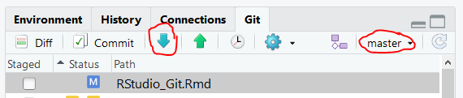

```{r setup, include=FALSE}
knitr::opts_chunk$set(echo = TRUE)
```

**Using Git at the command line**
------------------------------------------
### Broad Concept
Git is a version control system that allows you to take "snapshots" of your code (and other text-based documents). Think of it as having an undo button where you pick the undo points. 

As well, Git allows you to work from multiple *branches*. Without a version control system, you might make a copy of a file in order to try out an idea that could work but might just mess things up. This can get out of control pretty quickly and makes for a lot of copy-pasting (and a lot of confusion when you're trying to figure out which file is the master version). 

With Git, you always keep a single set of project files, and create a new branch when you want to try out some changes. You can go back to your original branch if the changes don't work out, and you can *merge* the new branch into the original branch if you want to keep your changes.

There are three places where Git keeps track of changes to your project: the working copy, the staging area, and the repository.

#### The Working Copy
This is where you make changes. It's just your normal project files that are stored on your hard drive.

#### The Staging Area
The cool thing about Git is that it lets you keep track of your changes in a series of snapshots, which you can go back and look at and undo if necessary. This is most useful when each snapshot represents a small number of changes that are closely related. That way, if you need to undo a snapshot, you won't be undoing other, unrelated work that you wanted to keep.
This is where the staging area comes in. Things you put in the staging area will be part of a single snapshot. So, once you've made some changes in the working copy, you can pick and choose which changes belong together in a snapshot by staging just those changes. Once you've saved the snapshot, you can stage some other changes that belong in a separate snapshot, and so on until all of your changes are saved.

#### The Repository
The repository (saved history) in Git consists of a series of snapshots, called *commits*. Each commit represents a set of changes and stores information about who made the commit, which commit came before it, and a brief user-supplied message about what changes were made.

### Getting Started
To initialize a repository, right click on the folder containing your project and select **Git bash here** to open the Git command line. Type `git init` at the command line. This initializes an empty repository in your project folder.

### Saving Changes
To add a changed file to the staging area, type `git add [filename]`. You can do this for as many files as you would like to include in the next commit.

To actually make a commit, type `git commit -m '[your message here]'`. Your message should be brief but should indicate what was done.

### Branching
Make a new branch any time you start working on a new section of your project or when you're about to try a new approach that you may or may not end up sticking with. It is helpful to treat the master branch as the version of your project that works.

To make a new branch, type `git branch [name of branch]` at the command line. To work from that branch, you need to *check it out* by typing `git checkout [name of branch]`.

### Undoing a Commit
To undo the changes included in a commit, first type `git log --abbrev-commit` at the command line. The `git log` command lets you view a list of previous commits along with their unique IDs, and the `--abbrev-commit` option tells Git to just show the short version of the commit IDs.

Once you have located the commit that you would like to undo, take note of its ID and then use the command `git revert [ID]`, where `[ID]` is the unique ID of the commit to be undone.

**Using Git in RStudio**
-----------------------------------------
### Enabling Git

#. Go to Tools -> Global Options -> Git/SVN
#. Check the box next to **Enable version control interface for RStudio projects**
#. Under **Git executable**, provide the path to your computer's Git installation (probably C:/Program Files/Git/bin/git.exe)

### Getting Started {.tabset .tabset-pills .tabset-fade}

Start from...

#### Scratch

#. Go to File -> New Project
#. In the window that pops up, select **New Directory**
#. Select **New Project**
#. Pick a name for your project directory, and choose where it will be stored
#. Make sure to check the box next to **Create a git repository**
#. Click **Create Project**

#### Existing R Project

Go <https://support.rstudio.com/hc/en-us/articles/200526207-Using-Projects>[link](**here**) for more information about projects in RStudio.

#. Open the project in RStudio
#. Go to Tools -> Project Options -> Git/SVN
#. Set **Version control system:** to **Git**
#. RStudio will ask if you want to initialize a new git repository; select **Yes**
#. RStudio will say that it needs to restart to apply your changes; select **Yes**

#### Existing GitHub Repo

#. Go to File -> New Project
#. In the window that pops up, select **Version Control**
#. Select **Git**
#. Enter the repository URL
#. Pick a name for your project directory, and choose where it will be stored
#. Click **Create Project**

### Basic Git operations in RStudio

#### Staging Changes
To stage all the changes made to a file since the last commit, check the box next to it in RStudio's Git tab.


You can also pick and choose which changes to stage. Click the **Commit** button to review your changes. Lines highlighted in red have been deleted since the last commit, and lines highlighted in green have been added. Click to select the changes you wish to include in the next commit (ctrl-click to select multiple changes).


#### Committing

Click the **Commit** button in the main RStudio window to review your changes if you haven't already. In the Review Changes window, enter a brief but descriptive commit message in the commit message box and click the **Commit** button below.

#### Branching
To add a branch, first make sure you're on the branch you want to use as your jumping-off point. Then click the branch icon under the Git tab in RStudio.


Give the new branch a descriptive name and check the **Sync branch with remote** box if you want to be able to push the branch to GitHub.


#### Pulling from GitHub

This is how you incorporate your collaborators' changes into your local working directory. Typically, you'll pull changes into your local master branch.



#### Pushing to GitHub

This is how you send your latest work to GitHub. Except for when you are populating an empty GitHub repository with your initial project files, *do not push your local master branch to GitHub*. Instead, push the branch that you have been working in. When you are ready to incorporate your changes into the master branch on GitHub, make a pull request in GitHub. This gives your collaborators an opportunity to review your work before it becomes part of the master branch.


#### View Commit History


### Troubleshooting


**Using GitHub**
------------------------------------------

### Getting Started {.tabset .tabset-pills}

Start from...

#### Existing Local Repo

#### GitHub Repo - Your Project

#### GitHub Repo - Someone Else's Project

### Syncing with GitHub

#### Share Your Work to GitHub

#### Incorporate Changes Made by Others